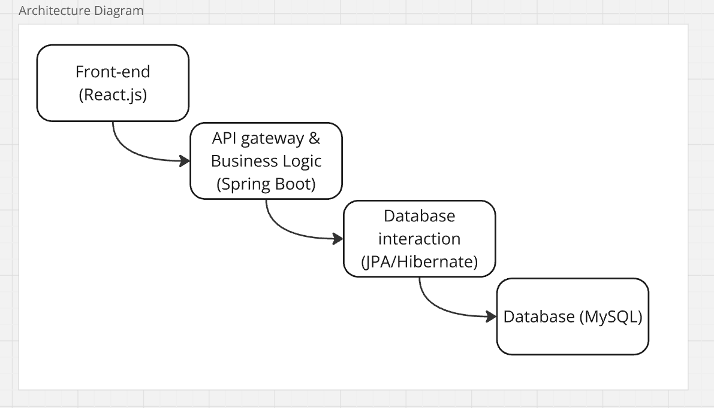
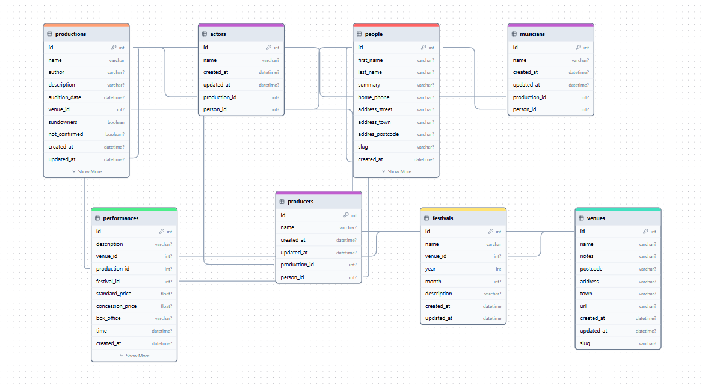
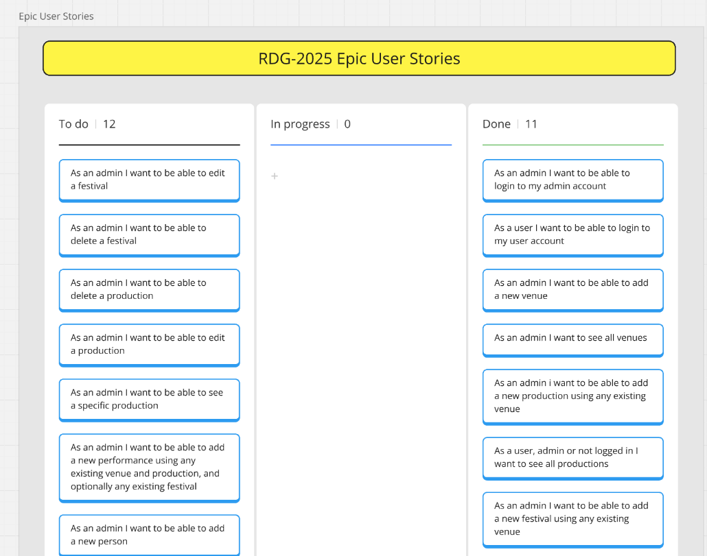
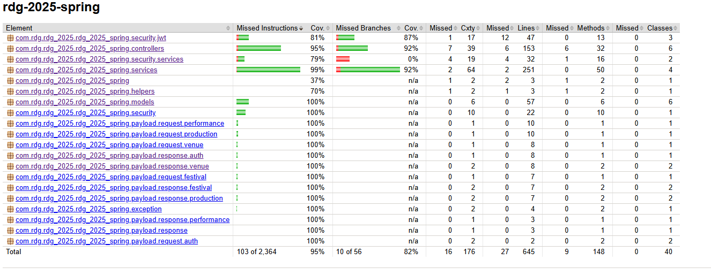

## RDG-2025 Spring / React.js Project

This project is a web application for an amateur theatre group I have been part of for many years. It is a migration/rebuild of an existing project made in 2008 in Ruby on Rails, which can be visited currently at [rdg.org](https://rdg.org/). There are about 60 years of production and actor data, and the aim is to make a comprehensive, easily navigable and easily updatable database interface (as well as giving it a much needed makeover), while also giving me more practice with the Spring framework.

### Project Structure

The overall structure of the project is displayed by the following:

Given I am working with existing data, my first step was to examine and understand the structure of the relational database, and the core of the data follows this structure:

As well as this, there are to two types of users that can be logged in to the application, with 'User' and 'Admin' roles.

### Development process

Using the database relationship diagram, I created user stories in priority order beginning with venues interactions, as many of the database objects have many to one relationships between them and venues so it made sense to start there and then expand out.

When completing a user story, my development process has been:

* Create a **route diagram** showing the route a request may take through the Spring application and what types of response will be applicable in different situations.
* If required, create a new entity class with relevant annotations so as to follow the database schema and any validation.
* Using TDD, create the relevant **service** method.
* Using TDD, create the relevant **controller** method and request/response classes.
* Run **integration tests** for the route.
* Create relevant **front-end** page to interact with route, focusing entirely on functionality ahead of styling.

I have used route diagrams as guiding lights during the back-end development process, as they make it clear exactly what interactions the service needs to make, exactly what interactions the controller needs to make and all the routes a request can take for integration testing.

### Progress so far 

The following is a list of entities and their corresponding routes that have been implemented so far:

**Venues**
* POST ("/venues") - create new venue
* GET ("/venues") - get all venues
* GET ("/venues/{id}") - get specific venue and associated data
* PATCH ("/venues/{id}") - update venue
* DELETE ("/venues/{id}") - delete venue and set associated data venue id field to null

**Productions** 
* POST ("/productions") - create new production
* GET ("/productions") - get all productions
* GET ("/productions/{id}) - get specific production
* PATCH ("/productions/{id}) - update production
* DELETE ("/productions/{id}) - delete production

**Festivals**
* POST ("/festivals") - create new festival
* GET ("/festivals") - get all festivals
* GET ("/festivals") - get specific festival
* PATCH ("/festivals/{id}") - update festival
* DELETE ("/festivals/{id}) - delete festival

**Performances**
* POST ("/performances") - add new performance
* DELETE ("/performances/{id}) - delete a performance

As well as the above, there are also /signup and /signin routes, although signing up has no associated front end interface as this application does not require users to be able to sign up. Many of the existing routes require an admin token to carry out.

### Testing

I have found that the process of TDD service, TDD controller and then integration tests has been comprehensive and effective. I have used junit and mockito to mock outside calls in the unit tests of the service and controller.

The exception to my TDD process has been the auth sign in system. I followed an online guide to create this, and therefore I have only completed integration tests on the /signin and /signup routes.

I have also chosen at this stage not to test the front-end application, as my focus with this project has been the Spring back-end and getting more familiar with building applications in Spring. When I come to implement further styling on the front-end, I will also complete tests.

### Going forward

There is still a long way to go with this project. Further CRUD operations for festivals and performances are required, as well as introducing people (and their different credits).

Once the back-end is complete, I will host the MySQL instance online (probably GCP) and upload the existing data (which I currently have as csv files on my computer), and test that the Spring application interacts with the production database as expected. I anticipate there will be some teething issues here as I integrate with existing data, although I have done everything I can to ensure the application will work with the data.

At that stage, I will then add more styling to the front end using TailwindCSS, as well as tests.

### Full Route Diagrams can be found [inside the spring application](https://github.com/julianhumble1/new-rdg-2025/tree/main/rdg-2025-spring)