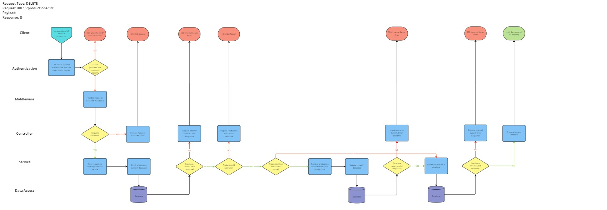
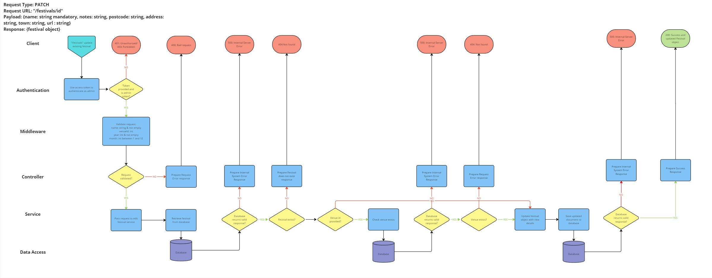

## Spring application routes and diagrams

### Completed routes

**Venues**
* POST ("/venues") - create new venue
* GET ("/venues") - get all venues
* GET ("/venues/{id}") - get specific venue and associated data
* PATCH ("/venues/{id}") - update venue
* DELETE ("/venues/{id}") - delete venue and set associated data venue id field to null

**Productions**
* POST ("/productions") - create new production
* GET ("/productions") - get all productions
* GET ("/productions/{id}) - get specific production
* PATCH ("/productions/{id}) - update production
* DELETE ("/productions/{id}) - delete production

**Festivals**
* POST ("/festivals") - create new festival
* GET ("/festivals") - get all festivals
* GET ("/festivals") - get specific festival
* PATCH ("/festivals/{id}") - update festival
* DELETE ("/festivals/{id}) - delete festival

**Performances**
* POST ("/performances") - add new performance

### Diagrams

#### Venues

#### Productions

#### Festivals

### Performances

